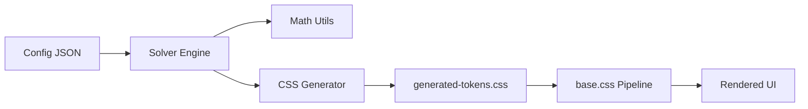

# Solver Architecture

The Color System is built around a **Solver Engine** that mathematically guarantees accessible contrast ratios across all themes and surfaces.

## The Pipeline

The system follows a unidirectional data flow:

## 1. Configuration (`surface-lightness.config.json`)

The single source of truth. It defines:

- **Anchors**: The fixed points of the system (e.g., Page Background is 100% lightness in Light Mode).
- **Surfaces**: Semantic roles (Card, Action, Spotlight) and their polarity (Page-aligned or Inverted).
- **Constraints**: Required contrast offsets and border visibility targets.

## 2. The Solver Engine (`scripts/solver/index.ts`)

The core logic that "solves" for lightness.

1.  **Anchor Alignment**: Determines the absolute lightness of the background for the current mode (Light/Dark).
2.  **Contrast Target Calculation**: Based on the surface's role (e.g., "Action" needs more contrast than "Card"), it calculates the target APCA contrast value.
3.  **Binary Search**: It uses `math.ts` to perform a binary search for the exact lightness value that satisfies the contrast target against the background.

## 3. Math Utilities (`scripts/solver/math.ts`)

Pure functions that handle the heavy lifting:

- **APCA Integration**: Wraps the `apca-w3` library to calculate perceptual contrast.
- **Hue Shifting**: Implements a cubic Bezier curve to rotate hues as lightness changes (preventing "muddy" colors).
- **Isomorphic Design**: These utilities are dependency-free and run in both Node.js (build time) and the Browser (runtime demos).

## 4. CSS Generator (`scripts/solver/generator.ts`)

Converts the solved mathematical values into CSS Custom Properties.

- **Token Structure**: Generates `--surface-token`, `--text-token`, etc.
- **Relative Color Syntax**: Uses `oklch(from ...)` to apply dynamic hue and chroma adjustments at runtime.
- **Light-Dark Functions**: Uses `light-dark()` to package both modes into a single property, enabling instant theme switching without JavaScript.

## 5. The Runtime (`base.css` + `utilities.css`)

The browser consumes the generated tokens.

- **`base.css`**: Sets up the global `color-scheme` and transition properties.
- **`utilities.css`**: Maps semantic class names (e.g., `.surface-card`) to the generated tokens.
