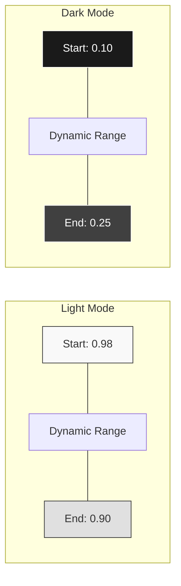

# Anchors

**Anchors** are the fixed points that define the dynamic range of your color theme. They tell the solver where to start and where to end.

## The Concept

Imagine a slider that represents Lightness (0% to 100%).

- In **Light Mode**, your page background might be at 98% lightness.
- In **Dark Mode**, your page background might be at 10% lightness.

These points are **Anchors**. The solver uses them to calculate the available space for all other surfaces.



## Anchor Types

### 1. Start Anchor (`bg-start`)

This defines the background of your application (usually `surface-page`).

- **Light Mode**: Typically high lightness (e.g., 0.98).
- **Dark Mode**: Typically low lightness (e.g., 0.10).

### 2. End Anchor (`bg-end`)

This defines the lightness of the most elevated or "highest" surface in the stack.

- **Light Mode**: Usually slightly darker than the start (e.g., 0.90), creating a "layered" effect where cards are slightly darker than the page.
- **Dark Mode**: Usually lighter than the start (e.g., 0.20), creating a "light-on-dark" effect.

### 3. Foreground Anchors (`fg-start`, `fg-end`)

These define the range for text and icons.

- **Strong Text**: Needs high contrast against the background.
- **Subtle Text**: Needs lower contrast but still readable.

## Adjustable Anchors

Some anchors can be marked as `adjustable`. This gives the solver permission to move them if necessary to meet accessibility goals.

**Example:**
If you set your Dark Mode background to `0.0` (Pitch Black), but your brand color has low luminance, the solver might not be able to find a text color that passes APCA 60. If the background anchor is `adjustable`, the solver might bump it up to `0.05` to reduce the contrast requirement or find a better middle ground.

## Configuration

Anchors are defined in `color-config.json`:

```json
{
  "anchors": {
    "light": {
      "bg": { "start": 0.98, "end": 0.9 },
      "fg": { "start": 0.1, "end": 0.5 }
    },
    "dark": {
      "bg": { "start": 0.1, "end": 0.25 },
      "fg": { "start": 0.95, "end": 0.7 }
    }
  }
}
```
