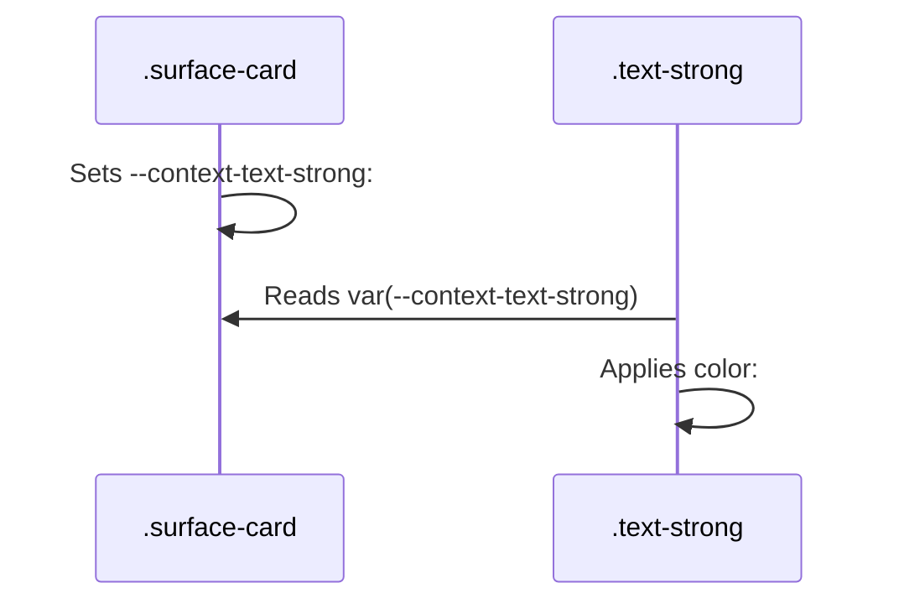

# Context & Polarity

**Context** is the mechanism that allows the color system to adapt to different environments (Light Mode, Dark Mode, High Contrast) without changing your code.

## Polarity

The system divides the world into two "polarities":

### 1. Page Polarity (`page`)

This is the standard polarity. It follows the system theme.

- **Light Mode**: Light background, Dark text.
- **Dark Mode**: Dark background, Light text.

Most surfaces (`surface-page`, `surface-card`) use Page Polarity.

### 2. Inverted Polarity (`inverted`)

This polarity flips the relationship.

- **Light Mode**: Dark background, Light text.
- **Dark Mode**: Light background, Dark text (or a lighter dark).

Surfaces like `surface-spotlight` (Tooltips, Toasts, Primary Buttons) often use Inverted Polarity to stand out.

## The Context Provider Pattern

Every surface acts as a **Context Provider**. It sets CSS variables that tell its children how to behave.

```css
/* Simplified CSS */
.surface-card {
  /* I am a light surface */
  --context-text-strong: #000000;
  --context-border: #cccccc;
}

.surface-spotlight {
  /* I am a dark surface */
  --context-text-strong: #ffffff;
  --context-border: transparent;
}
```

When you use a utility class like `.text-strong`, it doesn't have a color of its own. It simply asks the context:

```css
.text-strong {
  color: var(--context-text-strong);
}
```



## Live Demo

The following example is rendered using the actual Color System CSS. Notice how the text color automatically adapts when nested inside the dark `surface-spotlight`.

<div class="surface-page bordered" style="padding: 20px; border-radius: 8px;">
  <p class="text-strong" style="margin: 0 0 10px 0;">I am on the Page Surface.</p>
  <div class="surface-card bordered" style="padding: 20px; border-radius: 8px;">
    <p class="text-strong" style="margin: 0 0 10px 0;">I am on a Card Surface (Page Polarity).</p>
    <div class="surface-spotlight bordered" style="padding: 20px; border-radius: 8px;">
      <p class="text-strong" style="margin: 0;">I am on a Spotlight Surface (Inverted Polarity).</p>
    </div>
  </div>
</div>

## Why is this useful?

1.  **Portability**: You can move a component from a Card to a Spotlight, and the text will automatically invert.
2.  **Maintainability**: You don't need to write `.card .text` and `.spotlight .text` overrides.
3.  **Nesting**: It handles infinite nesting levels automatically.
