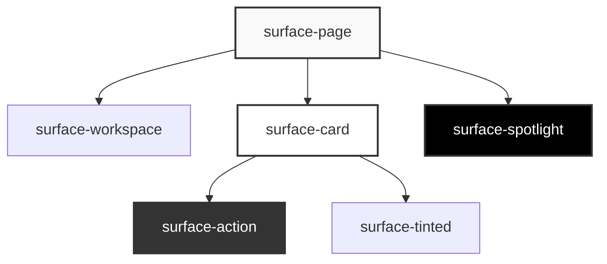

# Surfaces

A **Surface** is the fundamental building block of the Color System. It is not just a background color; it is a semantic container that defines the context for everything inside it.

## The Role of a Surface

When you apply a surface class (e.g., `.surface-card`), the system does three things:

1.  **Sets the Background**: It applies the calculated background color.
2.  **Sets the Context**: It updates local CSS variables (like `--context-text-strong`) to ensure text is readable on _this specific surface_.
3.  **Sets the Border**: It defines the default border color for elements inside it.

## Surface Types



### 1. The Canvas (Foundations)

These surfaces form the backdrop of your application.

- **`surface-page`**: The infinite background. Usually the lightest (in light mode) or darkest (in dark mode) point.
- **`surface-workspace`**: A slightly elevated area, often used for sidebars, navigation rails, or the main content area in a dashboard.

### 2. The Objects (Containers)

These surfaces hold content. They sit _on top_ of the canvas.

- **`surface-card`**: The workhorse of UI design. Used for panels, posts, and grouped content.
- **`surface-tinted`**: A subtle variation, often used to group related items without a hard boundary. It usually has a slight tint of the brand color.

### 3. The Interactors (Actions)

These surfaces are interactive. They invite clicks and touches.

- **`surface-action`**: Used for buttons, toggles, and active states.
- **`surface-action-soft`**: A lower-emphasis interactive surface (e.g., a secondary button).

### 4. The Spotlights (Attention)

These surfaces demand attention. They often invert the polarity to stand out.

- **`surface-spotlight`**: High contrast. Used for tooltips, toasts, and primary call-to-actions.
- **`surface-soft-spotlight`**: A softer version, often used for badges or indicators.

## Nesting Surfaces

Surfaces are designed to be nested.

```html
<div class="surface-page">
  <!-- Text here is optimized for the page -->
  <div class="surface-card">
    <!-- Text here is optimized for the card -->
    <button class="surface-action">
      <!-- Text here is optimized for the button -->
      Submit
    </button>
  </div>
</div>
```

Because each surface updates the `--context-*` variables, you can use the same utility classes (like `.text-strong`) everywhere, and they will automatically adapt.
